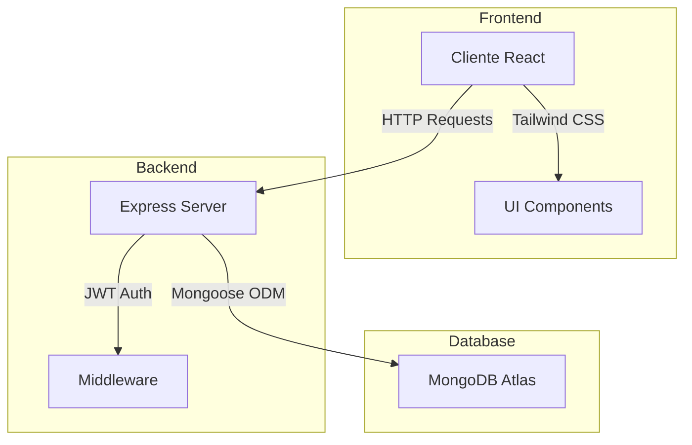

# Condiciones

Esta aplicación debe ser desarrollada en React, implementando la funcionalidad usando Express y persistiendo los datos con MongoDB.

La defensa consistirá en ejecutar la aplicación para mostrar su funcionalidad y, si está correctamente implementada, deberás mostrar el código fuente y explicar cómo funcionan las partes que se te indiquen.

Funcionalidad requerida
En la esquina superior izquierda debe ir el nombre del sitio.
En la esquina superior derecha deben haber dos botones: "Registrar" e "Ingresar", cuando no haya ningún usuario identificado.
Cuando el usuario haya ingresado, en la esquina izquierda debe estar el nombre del usuario y un botón "Salir".
Al pulsar en el nombre del usuario, se deberá poder editar los datos del mismo.
El sitio debe mostrar inicialmente una lista de contactos públicos ordenados por apellido y nombre.
El usuario que se registre podrá agregar nuevos contactos.
Los usuarios, al identificarse, podrán ver sus propios contactos y los contactos públicos que estén visibles.
Los usuarios son propietarios de los contactos que crean, siempre podrán visualizar sus contactos, editarlos o borrarlos.
Los usuarios podrán hacer público o privado sus contactos mediante un botón asociado a los mismos.
Las altas y la edición, así como la registración y el ingreso, se deben hacer en una página separada y, al completar la misma, debe regresar a la página principal.
Debe existir un usuario administrador que pueda visualizar todos los contactos, ya sean públicos o privados, estén visibles o no.
El usuario administrador puede ocultar o mostrar los contactos públicos mediante un botón que aparece en cada contacto.
Los usuarios se deben guardar como contactos privados con una contraseña asociada.
Los usuarios no deberán aparecer en el listado de contactos.
Los contactos deben tener:

Nombre y Apellido (obligatorio)
Empresa
Domicilio
Teléfonos
Email (obligatorio)
Propietario (usuario que lo creó)
Es Público (definido por el usuario propietario)
Es Visible (definido por el administrador)
Contraseña (en caso de ser un usuario)

# 📇 Agenda de Contactos Multiusuario

<div align="center">


### Una aplicación web completa para gestionar contactos con múltiples usuarios, autenticación segura y roles de administrador.

[🚀 Demo en Vivo](#demo) | [📥 Instalación](#instalación) | [🎯 Funcionalidades](#funcionalidades) | [🔧 Tecnologías](#tecnologías)

</div>

---

## 🎥 Demo

> **Usuario Administrador:** `admin@agenda.com` / `admin123`

[Aplicación Demo]

*Captura de la aplicación en funcionamiento*

### ✨ Características Principales

- 🔐 **Autenticación segura** con JWT y encriptación bcrypt
- 👥 **Sistema multiusuario** con roles normales y administrador
- 📱 **Interfaz responsive** moderna con Tailwind CSS
- 🗄️ **Base de datos en la nube** con MongoDB Atlas
- 🔄 **CRUD completo** para gestión de contactos
- 🎛️ **Control de visibilidad** público/privado por usuario
- 👑 **Panel de administrador** con permisos especiales

---

## 🚀 Instalación Rápida

### Requisitos Previos
```bash
Node.js 18+ ✅    # https://nodejs.org
Git ✅           # https://git-scm.com
```

### 1️⃣ Clonar el repositorio
```bash
git clone https://github.com/tu-usuario/agenda-contactos.git
cd agenda-contactos
```

### 2️⃣ Instalar dependencias
```bash
npm install
```

### 3️⃣ Ejecutar la aplicación

**🔥 Opción A: Un solo comando**
```bash
npm run start-all
```

**📱 Opción B: Terminales separadas**
```bash
# Terminal 1 - Backend
npm run server

# Terminal 2 - Frontend
npm run dev
```

### 4️⃣ Abrir en el navegador
```
🌐 Frontend: http://localhost:5173
🔧 Backend:  http://localhost:5000
👤 Admin:    admin@agenda.com / admin123
```

> ⚡ **¡Listo en 2 minutos!** La aplicación estará funcionando completamente.

---

## 🎯 Funcionalidades

### 🌍 Vista Pública (Sin Usuario)
- Ver contactos públicos ordenados por apellido
- Interfaz limpia con botones de registro e ingreso
- Acceso restringido a funciones de gestión

### 👤 Usuario Normal
- ✅ Registro e inicio de sesión seguro
- ✅ Crear, editar y eliminar contactos propios
- ✅ Cambiar visibilidad de contactos (público/privado)
- ✅ Ver contactos propios + contactos públicos de otros
- ✅ Editar perfil personal (clic en nombre de usuario)

### 👑 Usuario Administrador
- ✅ **Todas las funciones de usuario normal +**
- ✅ Ver TODOS los contactos (públicos y privados)
- ✅ Editar/eliminar contactos de cualquier usuario
- ✅ Ocultar/mostrar contactos públicos globalmente
- ✅ Panel de control completo

### 📋 Campos de Contacto
| Campo | Tipo | Descripción |
|-------|------|-------------|
| **Nombre** | Obligatorio | Nombre del contacto |
| **Apellido** | Obligatorio | Apellido del contacto |
| **Email** | Obligatorio | Correo electrónico |
| Empresa | Opcional | Empresa donde trabaja |
| Domicilio | Opcional | Dirección física |
| Teléfonos | Opcional | Números de contacto |

---

## 🔧 Tecnologías

### Frontend
- **React 19** - Framework de interfaz de usuario
- **Vite** - Build tool y servidor de desarrollo
- **Tailwind CSS** - Framework de estilos utilitarios
- **Lucide React** - Biblioteca de iconos moderna

### Backend
- **Express.js** - Framework web para Node.js
- **Node.js** - Runtime de JavaScript
- **JWT** - Autenticación basada en tokens
- **bcrypt** - Encriptación de contraseñas

### Base de Datos
- **MongoDB Atlas** - Base de datos NoSQL en la nube
- **Mongoose** - ODM para MongoDB

### Herramientas
- **Git** - Control de versiones
- **npm** - Gestor de paquetes
- **CORS** - Compartición de recursos entre orígenes

---

## 📊 Arquitectura



---

## 🎪 Cómo Probar

### 🎬 Flujo Completo de Demostración

1. **Vista Sin Usuario** → Ver contactos públicos
2. **Registrar Usuario** → Crear cuenta nueva
3. **Crear Contactos** → Agregar información personal
4. **Gestionar Visibilidad** → Cambiar público/privado
5. **Login Admin** → `admin@agenda.com` / `admin123`
6. **Funciones Admin** → Ver todos, ocultar contactos
7. **Editar Perfil** → Clic en nombre de usuario

### 📸 Screenshots

<details>
<summary>🖼️ Ver capturas de pantalla</summary>

#### Vista Principal
[Vista Principal]


#### Panel de Administrador
[Panel Admin]


#### Formulario de Contacto
[Formulario]

[Edicion de Perfil]

</details>

---

## 📁 Estructura del Proyecto

```
agenda-contactos/
├── 📂 src/
│   ├── 📂 components/
│   │   └── 📄 ContactosApp.jsx     # Componente principal
│   ├── 📄 api.js                   # Cliente API REST
│   ├── 📄 App.jsx                  # Componente raíz
│   ├── 📄 main.jsx                 # Entry point
│   └── 📄 index.css                # Estilos globales
├── 📄 server.js                    # Servidor Express
├── 📄 package.json                 # Dependencias y scripts
├── 📄 index.html                   # Template HTML
├── 📄 tailwind.config.js           # Configuración Tailwind
├── 📄 vite.config.js               # Configuración Vite
└── 📄 README.md                    # Este archivo
```
(estructura hipermega basica)
---

## 🛡️ Seguridad

### 🔐 Autenticación
- Contraseñas encriptadas con **bcrypt** (salt rounds: 10)
- Tokens **JWT** con expiración de 24 horas
- Middleware de autorización en todas las rutas protegidas 
(aunque no sea necesario)

### 🛂 Autorización
- Verificación de propietario para operaciones CRUD
- Roles diferenciados (usuario/administrador)
- Validación de permisos a nivel de endpoint

### 🧪 Validaciones
- Validación de datos en frontend y backend
- Sanitización de entradas de usuario
- Manejo seguro de errores sin exposición de información sensible

---

## 🚨 Solución de Problemas

<details>
<summary>❓ Problemas Comunes</summary>

### Puerto Ocupado (EADDRINUSE)
```bash
# Windows
netstat -ano | findstr :5000
taskkill /PID <PID> /F

# Mac/Linux
lsof -ti:5000 | xargs kill -9
```

### Error de Dependencias
```bash
rm -rf node_modules package-lock.json
npm install
```

### Error de MongoDB
La aplicación usa MongoDB Atlas (nube), no requiere instalación local.
Verificar conexión a internet.

### Problemas de CORS
El backend está configurado para aceptar requests desde localhost.
Para producción, actualizar configuración CORS.

</details>

---

## 🚀 Deployment

### todo local mi rey
---


---

<div align="center">

### ⭐ Si te gustó este proyecto, ¡dale una estrella!


**Hecho con ❤️ y ☕**

</div>

app basic, no pidan mucho xd
